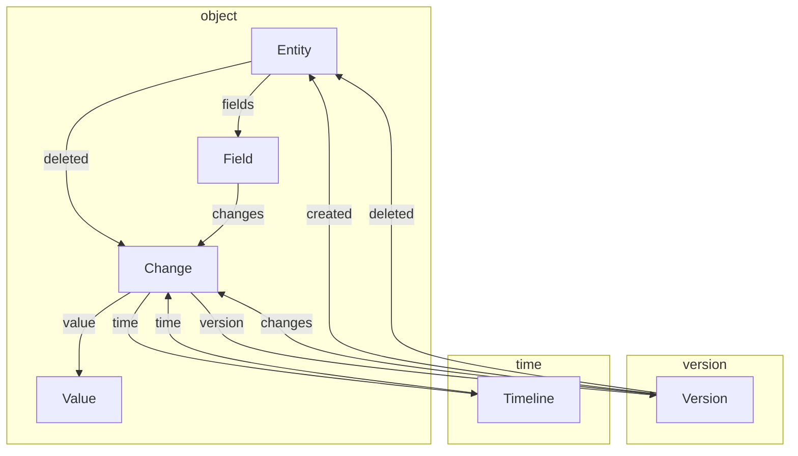

# WIP: BiTemporal Model for Neo4j
This library for BiTemporal Modeling in neo4j.

The BiTemporal Model has two different time axis.
1. ”Versioning” indicates when the change was commited.
2. "Timeline" indicates when the value will be applied.

With these two axes, we can see past and future events like a time machine.

- [x] versioning
- [x] timeline
- [wip] support Kotlin data class
- [ ] support JSONSchema? YANG?
- [ ] Auto-generate GraphQL API
- [ ] support primitive type
- [ ] support array type
- [ ] support key-value type
- [ ] constraints based on timeline

## Model diagram


## Modeling(Kotlin data class)
```kotlin
data class Data(
    override var id: UUID?,
    val string_value: String,
    val long_value: Long,
    val double_value: Double,
    val boolean_value: Boolean,
) : Model
```

## Supported Types
- [x] String
- [x] Long
- [x] Double
- [x] Boolean
- [ ] DateTime
- [ ] Array
- [ ] Key-Value
- [ ] Reference